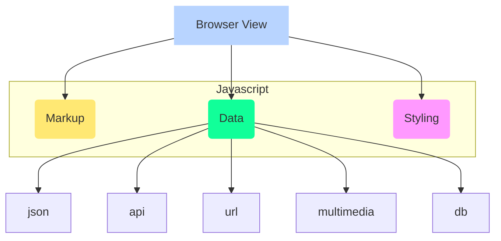

# Build

http://localhost:8095/en/

* builds 3 packages using `lerna`
* splitted the webpack config in multiple files

```bash
yarn build

yarn upgrade
build fails
```

How to revert after `yarn upgrade`?
:   `yarn.lock` files comes to rescue

One of the main features of webpack's compiler is to recursively parse all the modules,
starting from the entries, to build a graph of all the module dependencies by analyzing
`require()`, `require.context()`, `import` and `import()` expressions.

require.context is a special feature supported by webpack's compiler that allows you to
get all matching modules starting from some base directory. The intention is to tell
webpack at compile time to transform that expression into a dynamic list of all the
possible matching module requests that it can resolve, in turn adding them as build
dependencies and allowing you to require them at runtime.

All js code in side vue app is practically for webpack

Tooling | Description
--------|---------------
cross-env       | set env vars across platform
cross-spawn     | spawns process on system
lerna           | tool for managing JS projects with multiple packages


Case Styles | Example
------------|----------
Camel Case  | someFileName
Pascal Case | someFileName
Snake Case  | some_file_name
Kebab Case  | some-file-name

## docs

> Think about where data is coming from, and which datastructure to use for this particular data.

What we see on web is essentailly 3 things



* vue app
* can access DOM tree elements in vue properties
* can access environment variables
* its a full blown node development environment
* Lazy loading import syntax for components and routes
* even vuetify variables are exposed
* components can becalled by Kebab Cases markup even when names are Pascal Case
* Code snippets are stored in seperate files, read by webpack at runtime
* [ ] can use inline JS with in html attributes values bindings in vue files
* [ ] Homepage is broken down into seperate files.

```js
this._keywords = document.querySelector('meta[name="keywords"]')

:src="`https://cdn.vuetifyjs.com/images/home/${feature.src}`"

:max-width="1280 + ($vuetify.breakpoint.mdAndUp ? 48 : 0)"

```

* How to add examples?
  * packages/docs/src/lang/en/components/Hover.json
  * packages/docs/src/examples/hover/complex/transition.vue

### Do not understand

* 8 base-heading, base-section etc.
* https://docs.npmjs.com/creating-and-publishing-scoped-public-packages


## vuetify package

* Scss styles - Scss is written in `Ruby`
* How to write custome tyoes for typescript
* ECMA script new syntax, can export classes as well.
* [JS Interfaces](https://www.typescriptlang.org/docs/handbook/interfaces.html)
  * define types for objects, custom types
  * interfaces can also extends to other interfaces. Nested Inheritance
* Nested and multiple `extends` possible

```js
interface SquareConfig {
    color?: string;
    width?: number;
    [propName: string]: any;
}
```

## vuetify api-generator

